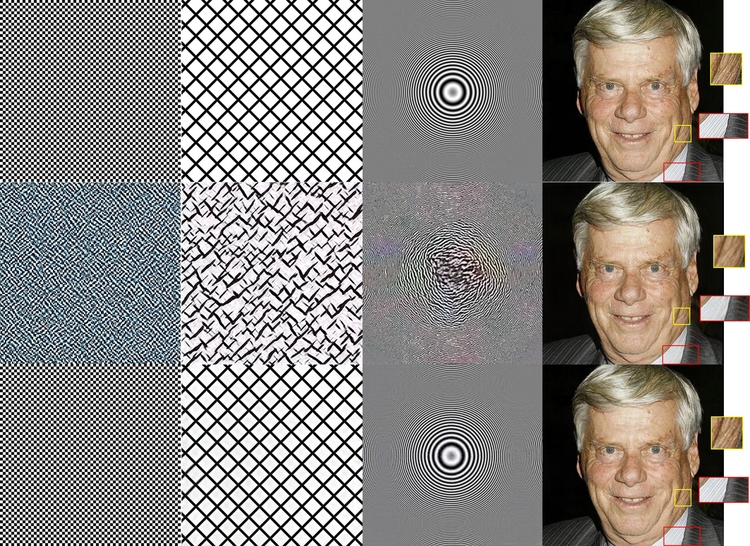

## Official Implementation of SWAGAN: A Style-based Wavelet-driven Generative Model

[](https://dl.acm.org/doi/10.1145/3450626.3459836)
[](https://arxiv.org/abs/2102.06108)




> **SWAGAN: A Style-based Wavelet-driven Generative Model**<br>
> Rinon Gal, Dana Cohen Hochberg, Amit Bermano, Daniel Cohen-Or <br><br>
>**Abstract**: <br>
> In recent years, considerable progress has been made in the visual quality of Generative Adversarial Networks (GANs). Even so, these networks still suffer from degradation in quality for high-frequency content, stemming from a spectrally biased architecture, and similarly unfavorable loss functions. To address this issue, we present a novel general-purpose Style and WAvelet based GAN (SWAGAN) that implements progressive generation in the frequency domain. SWAGAN incorporates wavelets throughout its generator and discriminator architectures, enforcing a frequency-aware latent representation at every step of the way. This approach, designed to directly tackle the spectral bias of neural networks, yields an improvement in the ability to generate medium and high frequency content, including structures which other networks fail to learn. We demonstrate the advantage of our method by integrating it into the SyleGAN2 framework, and verifying that content generation in the wavelet domain leads to more realistic high-frequency content, even when trained for fewer iterations. Furthermore, we verify that our model's latent space retains the qualities that allow StyleGAN to serve as a basis for a multitude of editing tasks, and show that our frequency-aware approach also induces improved high-frequency performance in downstream tasks.

## Requirements

Our code borrows heavily from the [original StyleGAN2 implementation.](https://github.com/NVlabs/stylegan2) The list of requirements is thus identical:

* 64-bit Python 3.6 installation. We recommend Anaconda3 with numpy 1.14.3 or newer.
* TensorFlow 1.14 or 1.15 with GPU support. The code does not support TensorFlow 2.0.
* On Windows, you need to use TensorFlow 1.14 &mdash; TensorFlow 1.15 will not work.
* One or more high-end NVIDIA GPUs, NVIDIA drivers, CUDA 10.0 toolkit and cuDNN 7.5.

## Using pre-trained networks

Pre-trained networks are stored as `*.pkl` files.

Paper models can be downloaded [here.](https://drive.google.com/drive/folders/1zb094xlZIIpnT8OfYb2QmRIb-6kDcQ1c?usp=sharing) More models will be made available soon.

To generate images with a given model, use:

```.bash
# Single latent generation
python run_generator.py generate-images --network=/path/to/model.pkl \
  --seeds=6600-6625 --truncation-psi=1.0 --result-dir /path/to/output/

# Style mixing
python run_generator.py style-mixing-example --network=/path/to/model.pkl \
  --row-seeds=85,100,75,458,1500 --col-seeds=55,821,1789,293 \
  --truncation-psi=1.0 --result-dir /path/to/output/
```

## Training networks

To train a model, run:

```.bash
python run_training.py --data-dir=/path/to/data --config=config-f-Gwavelets-Dwavelets \ 
  --dataset=data_folder_name --mirror-augment=true
```

For other configurations, see `run_training.py`.

## Evaluation metrics

### FID metrics can be computed using the original StyleGAN2 scripts:

```.bash
python run_metrics.py --data-dir=/path/to/data --network=/path/to/model.pkl \
  --metrics=fid50k --dataset=data_folder_name --mirror-augment=true
```

### Spectrum Gap plots:

Coming soon.

## License

The original StyleGAN2 implementation and this derivative work are available under the Nvidia Source Code License-NC. To view a copy of this license, visit https://nvlabs.github.io/stylegan2/license.html

## Citation

```
@article{gal2021swagan,
author = {Gal, Rinon and Hochberg, Dana Cohen and Bermano, Amit and Cohen-Or, Daniel},
title = {SWAGAN: A Style-Based Wavelet-Driven Generative Model},
year = {2021},
issue_date = {August 2021},
publisher = {Association for Computing Machinery},
address = {New York, NY, USA},
volume = {40},
number = {4},
issn = {0730-0301},
url = {https://doi.org/10.1145/3450626.3459836},
doi = {10.1145/3450626.3459836},
journal = {ACM Trans. Graph.},
month = jul,
articleno = {134},
numpages = {11},
keywords = {StyleGAN, wavelet decomposition, generative adversarial networks}
}
```

If you use our work, please consider citing StyleGAN2 as well:

```
@article{Karras2019stylegan2,
  title   = {Analyzing and Improving the Image Quality of {StyleGAN}},
  author  = {Tero Karras and Samuli Laine and Miika Aittala and Janne Hellsten and Jaakko Lehtinen and Timo Aila},
  journal = {CoRR},
  volume  = {abs/1912.04958},
  year    = {2019},
}
```

## Acknowledgements

We thank Ron Mokady for their comments on an earlier version of the manuscript.
We also want to thank the anonymous reviewers for identifying and assisting in the correction of flaw in an earlier version of our paper.
